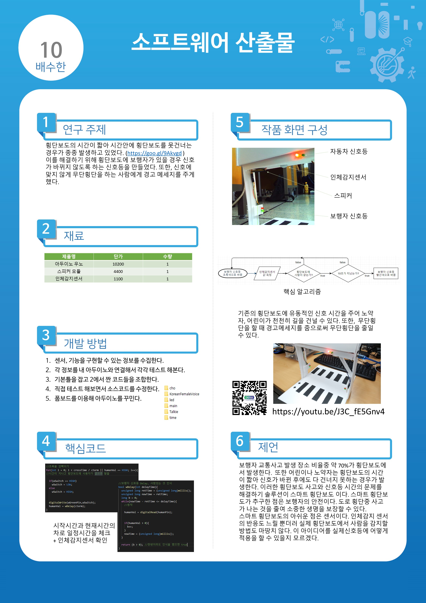
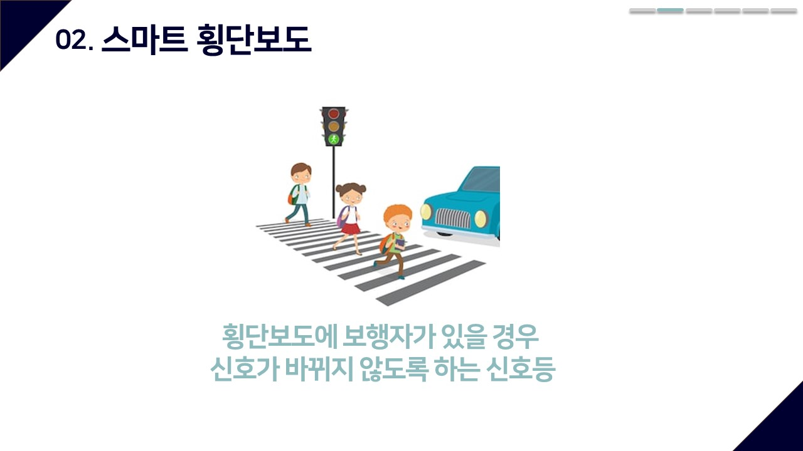

# smartcrosswalk
[네이버 블로그 링크](https://blog.naver.com/PostList.nhn?blogId=soohan530&from=postList&categoryNo=30)  
2학년 1학기 아두이노 프로젝트입니다.   

### 발표자료

4. 시연영상

### 참고사이트
- http://www.iamamaker.kr/ko/tutorials/arduino_voice_out/
- http://www.iamamaker.kr/ko/tutorials/talkie_library_voice_data/
